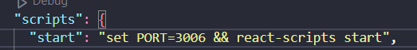

# Hướng dẫn sử dụng

<h4>Hướng dẫn</h4>
<ol>
<li>Mở folder public trong my-app</li>
<li>Đặt link file JSON làm tham số truyền vào hàm fetch() trong hàm getJSON() trong file script.js</li>
</img>
<li>Sử dụng terminal, cd đến thư mục "my-app" và chạy npm start </li>
<li>Ứng dụng mặc định chạy trên cổng 3006, có thể chỉnh trong "package.json" và đổi 3306 thành port bạn mong muốn</li>
</img>
<li>Script sẽ fetch JSON từ API cung cấp bới Backend và re-render trang web mỗi 1 giây</li>
</ol>

<h4>Các thành phần của giao diện</h4>
</img>

