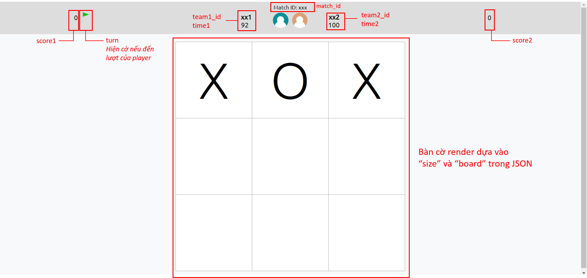

# Hướng dẫn sử dụng
<h3>Yêu cầu</h3>
<ul>
<li>Cần có Node.js và serve để chạy ứng dụng</li>
<li>Tải Node.js: <a href="https://nodejs.org/en/download">Link</a></li>
<li>Install serve (global): <pre>npm install --global server</li>
</ul>

<h3>Hướng dẫn chạy</h3>
<ol>
<li>Chạy sẵn Backend cung cấp file JSON</li>
<li>Mở file <i>script.js</i> trong folder <i>build</i></li>
<li>Đặt link API Backend làm tham số truyền vào hàm fetch trong hàm getJSON trong file <i>script.js</i></li>
</img>
<li>Sử dụng terminal, cd đến thư mục gốc (thư mục cha của <i>build</i>) và chạy: <pre>serve -s build</pre>
<li>Script sẽ fetch JSON từ API cung cấp bởi Backend và re-render trang web mỗi 1 giây</li>
</ol>

<h3>Các thành phần của giao diện</h3>
</img>

<h3>Troubleshooting (Windows)</h3>

Ở bước 4, nếu gặp lỗi: <pre>serve : File C:\...\serve.ps1 cannot be loaded because running scripts is disabled on this system. For more 
information, see about_Execution_Policies at https:/go.microsoft.com/fwlink/?LinkID=135170.
At line:1 char:1
+ serve -s build
+ ~~~~~
    + CategoryInfo          : SecurityError: (:) [], PSSecurityException
    + FullyQualifiedErrorId : UnauthorizedAccess</pre>

Cách sửa:
<ol>
<li>Chạy Powershell bằng quyền admin</li>
<li>Chạy command: <pre>Get-ExecutionPolicy</pre></li>
<li>Nếu execution policy hiện tại là "Restricted", chạy: <pre>Set-ExecutionPolicy RemoteSigned</pre></li>
<li>Gõ 'Y' và ấn Enter</li>
<li>Chạy lại <pre>serve -s build</pre></li>
</ol>
