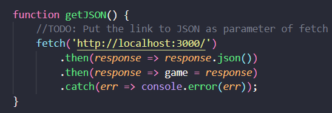

# Hướng dẫn sử dụng
<h4>Cấu trúc</h4>
<ul>
<li>index.html: File HTML hiển thị tất cả thông tin từ JSON</li>
<li>style.css: Style file index.html</li>
<li>script.js: Script fetch file JSON và render lại giao diện HTML từ thông tin trong JSON</li>
</ul>

<h4>Hướng dẫn</h4>
<ol>
<li>Mở file index.html để hiển thị giao diện</li>
<li>Đặt link file JSON làm tham số truyền vào hàm fetch() trong hàm getJSON() trong file script.js</li>
</img>
<li>Script sẽ fetch JSON và re-render trang web mỗi 1 giây</li>
</ol>

<h4>Các thành phần của giao diện</h4>
</img>

